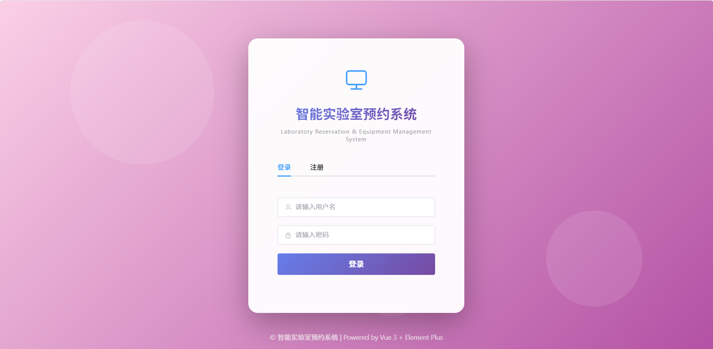
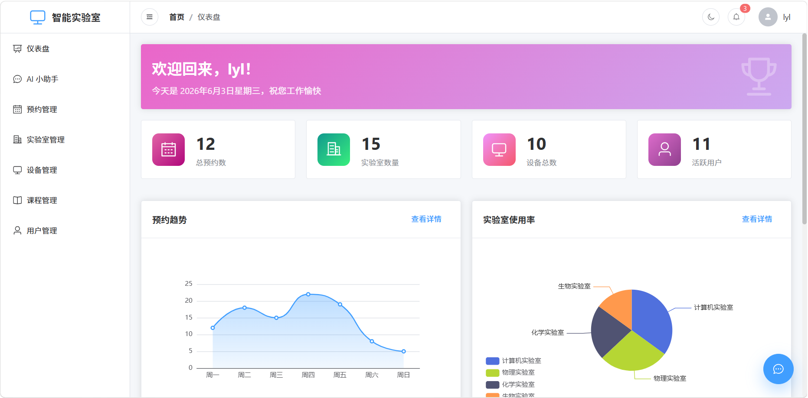
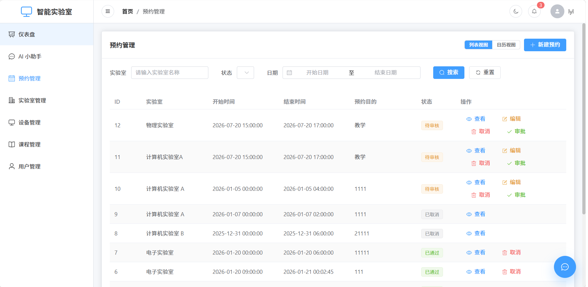
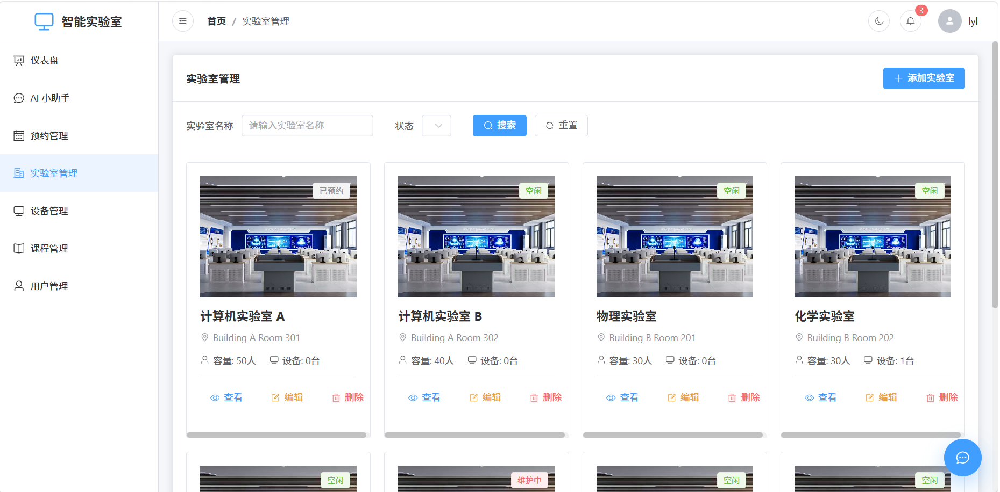
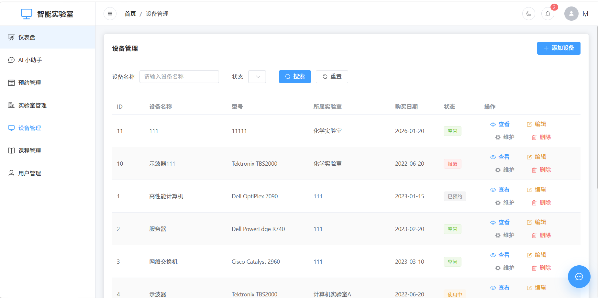
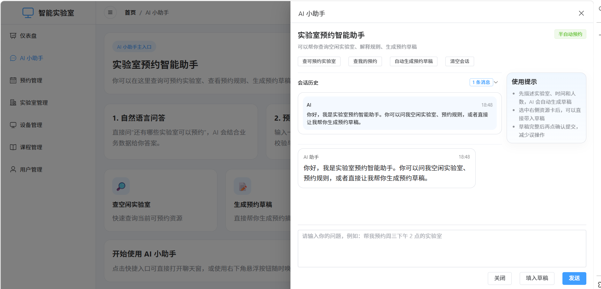

# 智能实验室预约与设备管理系统

> 面向高校实验室场景打造的综合管理平台，覆盖实验室预约、设备管理、课程管理与数据展示，并接入 AI 小助手提升查询与预约效率。

## 项目简介

这是一个面向高校教学与实验管理场景的前后端分离系统，围绕教师、学生与管理员三类角色，构建了从资源查询、预约申请、审批处理到设备维护的完整管理流程。

项目特色：
- 支持实验室预约、课程预约与多次预约等常见使用场景
- 覆盖实验室、设备、课程与用户等核心业务模块
- 提供预约冲突检测、审批流转、签到/签退等关键业务能力
- 集成 AI 小助手，可通过自然语言辅助查询、推荐与生成预约草稿
- 配备仪表盘与统计页面，便于直观展示系统运行效果

---


## 项目截图

### 登录 / 注册页面



### 首页仪表盘



### 预约管理



### 实验室管理



### 设备管理



### AI 小助手



---

## 功能亮点

### 用户与权限管理
- 支持用户注册、登录与退出
- 提供管理员、教师、学生等角色权限控制
- 支持个人信息维护与密码修改

### 实验室管理
- 维护实验室基础信息
- 管理实验室状态：空闲、使用中、维护中
- 记录容量、位置、类型等关键属性

### 设备管理
- 维护设备基础信息
- 管理设备状态：正常、使用中、维护中、损坏
- 记录设备维护情况与使用状态

### 预约管理
- 支持单次预约与多次预约
- 支持课程绑定预约
- 提供冲突检测与审批流程
- 支持预约取消、签到与签退

### 课程管理
- 维护课程基础信息
- 管理课程与学生的关联关系
- 支持课程与预约业务联动

### 数据统计展示
- 展示预约趋势分析
- 展示实验室使用统计
- 展示设备使用统计
- 展示用户活跃度统计

### AI 小助手
- 支持自然语言查询实验室与预约规则
- 推荐可预约实验室
- 自动生成预约草稿
- 信息不完整时主动追问补全
- 仅在实验室匹配后才允许进入可提交状态

---

## 技术栈

### 前端页面技术
- Vue 3
- Vite
- Element Plus
- Pinia
- Vue Router
- Axios
- ECharts

### 业务后端技术
- Java 17
- Spring Boot
- Spring Security
- JWT
- MyBatis Plus
- MySQL
- Maven

### AI 小助手服务
- Node.js
- Express
- 用于 AI 会话与预约草稿生成的独立服务
- 与主业务后端解耦，便于单独部署与扩展

---

## 项目结构

```bash
智能实验室预约与设备管理系统/
├── backend/                  # 后端项目（Spring Boot）
├── frontend/                 # 前端项目（Vue 3）
├── ai-server/                # AI 辅助服务（Node.js）
├── README.md                 # 项目说明
└── docs/                     # 文档与截图
    └── images/               # 项目截图
```

---

## 本地运行

### 环境要求
- Node.js 16+
- npm 或 yarn
- Java 17+
- MySQL 8.0+

### 1. 启动后端

```bash
cd backend
mvn spring-boot:run
```

默认运行地址：`http://localhost:8080`

### 2. 启动前端

```bash
cd frontend
npm install
npm run dev
```

默认运行地址：`http://localhost:5173`

### 3. 启动 AI 服务

```bash
cd ai-server
npm install
npm run dev
```

默认运行地址：`http://localhost:3001`

---

## 数据库配置

1. 在 MySQL 中创建数据库：

```sql
CREATE DATABASE lab_management CHARACTER SET utf8mb4 COLLATE utf8mb4_unicode_ci;
```

2. 修改后端配置文件：

```yaml
spring:
  datasource:
    url: jdbc:mysql://localhost:3306/lab_management
    username: your_username
    password: your_password
```

---

## 核心页面

- 登录 / 注册页：支持用户登录、注册与身份切换
- 仪表盘：展示系统统计数据与图表
- 预约管理：呈现预约申请、审批与状态流转
- 实验室管理：维护实验室基础信息与状态
- 设备管理：维护设备信息与维护记录
- 课程管理：管理课程与课程预约关系
- AI 小助手：辅助查询、推荐与生成预约草稿

---

## 作品集亮点

- 面向高校真实使用场景，业务结构完整
- 前端页面与业务后端分层清晰，便于展示系统架构
- AI 小助手独立部署，体现项目扩展性与模块化设计
- 包含数据统计与可视化页面，增强作品展示效果
- 支持多角色协同，能体现权限与流程控制能力

---

## 简历项目描述

**智能实验室预约与设备管理系统**：
基于 Vue 3、Java Spring Boot 与 Node.js/Express 构建的高校实验室管理平台，覆盖实验室预约、设备管理、课程管理、审批流与数据统计，并集成 AI 小助手实现自然语言查询与预约草稿生成，提升了系统易用性与交互效率。

---

## 后续优化方向

- 优化日历视图与预约体验
- 增加消息通知能力
- 支持数据导出
- 完善移动端适配
- 优化 AI 推荐与追问策略

---

## 说明

本项目用于课程设计、作品集展示与学习交流。
